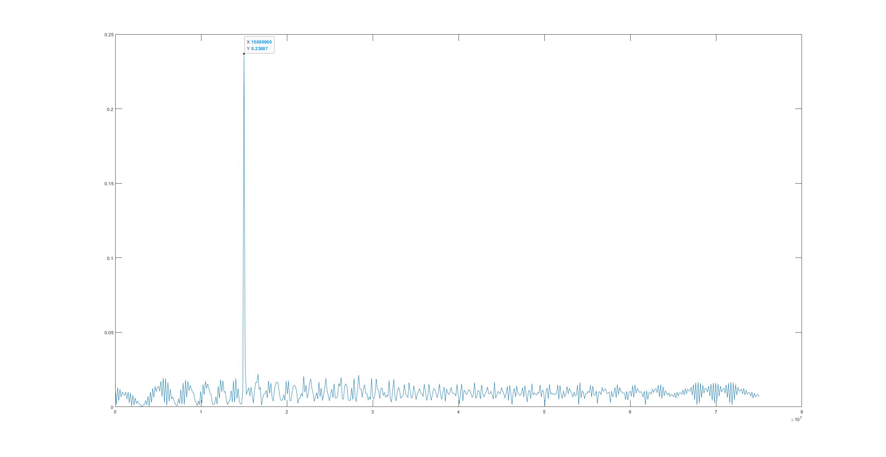
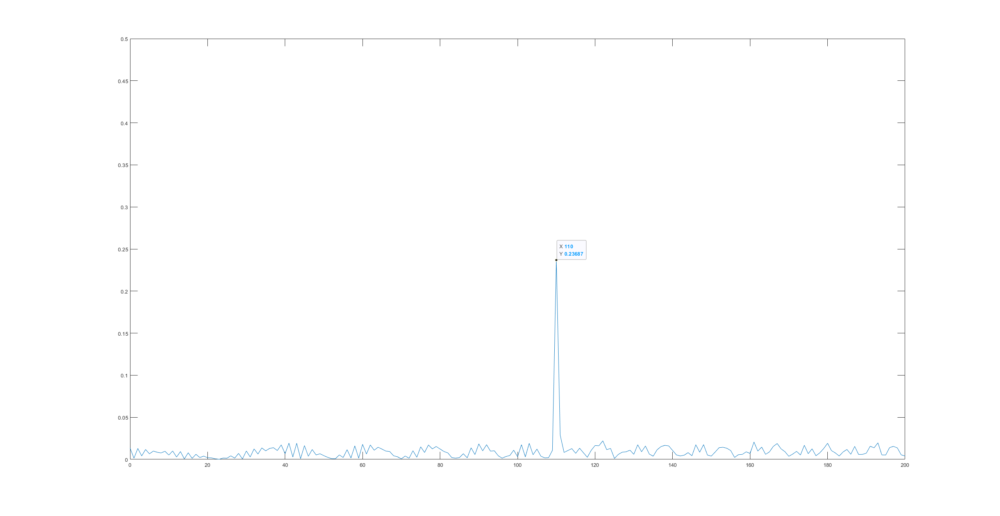
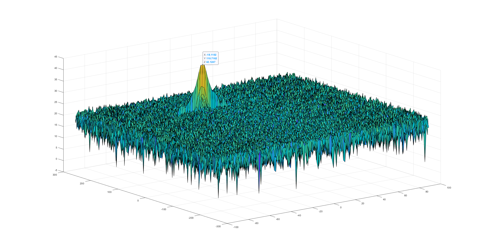
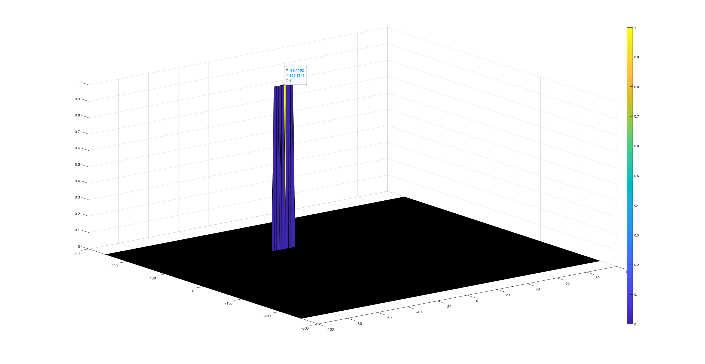

# radar-target-detection


## Overview

In this project, we will:

- Configure the FMCW waveform based on the system requirements.
- Define the range and velocity of target and simulate its displacement.
- For the same simulation loop process the transmit and receive signal to determine the beat signal
- Perform Range FFT on the received signal to determine the Range
- Towards the end, perform the CFAR processing on the output of 2nd FFT to display the target.








## 2D CFAR Process

The 2D CFAR is similar to 1D CFAR, but is implemented in both dimensions of the range Doppler block. The 2D CA-CFAR implementation involves the training cells occupying the cells surrounding the cell under test with a guard grid in between to prevent the impact of a target signal on the noise estimate.


- Determine the number of Training cells for each dimension. Similarly, pick the number of guard cells.

  > In this implementation, because the Range x Doppler matrix has the dimension of  512 x 128, so I choose: 
  >
  > - Training cells Tr = 12 and Td = 6, which correspond to range and Doppler dimension. 
  > - Similarly, Gr = 6 and Gd = 3 for Guard cells. 
  > - And offset = 2 db.

- Slide the Cell Under Test (CUT) across the complete matrix. Make sure the CUT has margin for Training and Guard cells from the edges.

- For every iteration sum the signal level within all the training cells. To sum convert the value from logarithmic to linear using db2pow function.

  > Step 1: Sum up the values from all Training, Guard Cells and CUT 
  >
  > ```matlab
  > s1 = sum(RDM(i:i+2*Tr+2*Gr, j:j+2*Td+2*Gd),'all');
  > ```
  >
  > Step 2: Sum up the values from all Guard Cells and CUT
  >
  > ```matlab
  > s2 = sum(RDM(i+Tr:i+Tr+2*Gr, j+Td:j+Td+2*Gd),'all');
  > ```
  >
  > Step 3: Calculate noise level by subtract s2 from s1
  >
  > ```matlab
  > noise_level = s1 - s2;
  > ```

- Average the summed values for all of the training cells used. After averaging convert it back to logarithmic using pow2db.

  > Step 1: Calculate number of cells from all Training, Guard Cells and CUT 
  >
  > ```matlab
  > n1 = (2*Tr+2*Gr+1)*(2*Td+2*Gd+1);
  > ```
  >
  > Step 2: Calculate number of cells from all Guard Cells and CUT 
  >
  > ```matlab
  > n2 = (2*Gr+1)*(2*Gd+1);
  > ```
  >
  > Step 3: Calculate number of Training Cells by subtract n2 from n1
  >
  > ```matlab
  > n = n1 - n2;
  > ```

- Further add the offset to it to determine the threshold.

- Next, compare the signal under CUT against this threshold.

- If the CUT signal level is greater than the Threshold, assign a value of 1, else equate it to zero.

- Since the cell under test are not located at the edges, due to the training cells occupying the edges, we suppress the edges to zero. Any cell value that is neither 1 nor a 0, assign it a zero.








## References

1. [Udacity Sensor Fusion Nanodegree Program](https://www.udacity.com/course/sensor-fusion-engineer-nanodegree--nd313)
2. [Automotive Adaptive Cruise Control Using FMCW Technology](https://www.mathworks.com/help/phased/examples/automotive-adaptive-cruise-control-using-fmcw-technology.html)